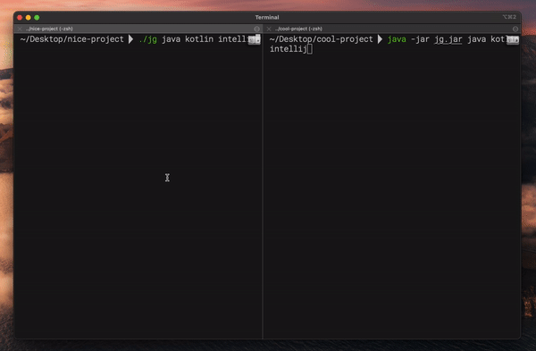

<h1 align="center">jignore: CLI for generating .gitignore files</h1>
<p>
  <a href="https://twitter.com/hjnowakowski">
    
  </a>
</p>

## Description

`jignore` is a CLI app that can generate .gitignore contents.
`jignore` is written in Java and can be compiled to the native image (thanks to GraalVM). 


## Disclaimer

> The app uses the .gitignore collection from [gitignore.io](https://docs.gitignore.io/use/api)

## Performance comparison

The left Terminal shows the execution of the **native image**. The right one uses **jar** program.
The difference is not huge, however still clearly visible. Note that native image does not require JVM to run.

<div align="center"> 

</div>

## Prerequisites

* GraalVM Component Updater v2.0.0 (used to install `native-image`)
* GraalVM native-image building tool

## Installing GraalVM tools

I've used brew to download the GraalVM

```sh
brew install --cask graalvm/tap/graalvm-ce-lts-java11

gu install native-image # Installs the native-image tool that is used to generate an executable
```

## Build and run as native image

```sh
./gradlew jar #Creates a jar with the app in the build/libs directory

cd build/libs

native-image -jar jg-1.0-SNAPSHOT.jar \
 -H:IncludeResources='gitignore.io.json' \ #graalvm needs to have resources explicitly referenced
 -H:ReflectionConfigurationFiles="<DIR-TO-THE-PROJECT>/src/main/resources/reflection-config.json" \ #since we are deserializing the json file, we need to provide proper reflection configuration
 --no-fallback
```

## Author

👤 **Henryk Nowakowski**
